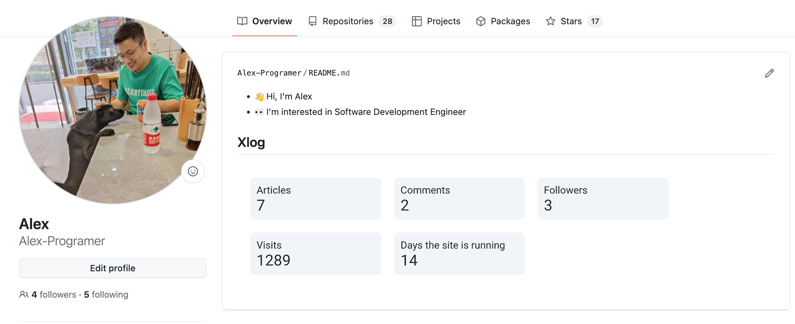
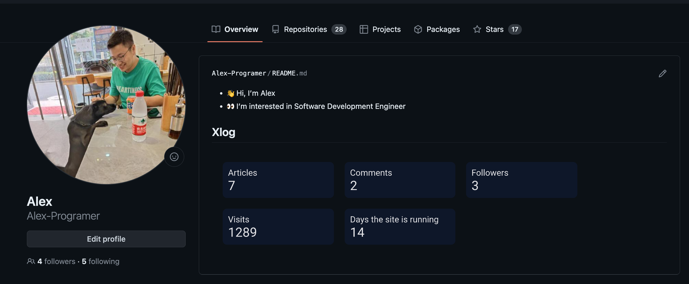
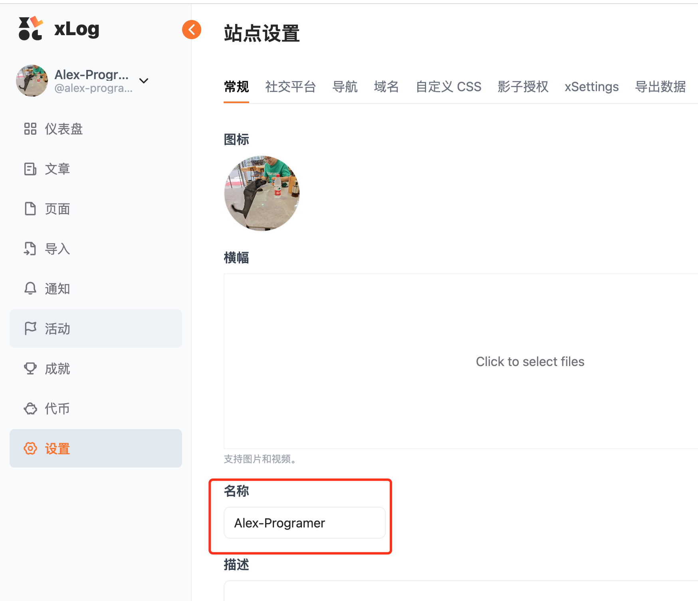

# xlog card





## 使用方法

### 获取个人的 xlog 名称



复制自己设置的名称，和这个接口对上即可

> 注意：经过 <a href="https://blog.furrysp.top/">DragonJay</a>的提醒，名称的获取方式可能存在错误引导。
> “不对，不应该是获取设置里的那个名称，而是域名之前的那个名称
xxx.xlog.app 里的 xxx
在后台 /dashboard/xxx 也可以获取到”

### 指定一个主题

```shell
https://xlog-card.vercel.app/api/Alex-Programer?theme=light
```

### 根据系统主题来切换

```html
<picture>
  <source
    media="(prefers-color-scheme: light)"
    srcset="https://xlog-card.vercel.app/api/diygod?theme=light"
  />
  <source
    media="(prefers-color-scheme: dark)"
    srcset="https://xlog-card.vercel.app/api/diygod?theme=dark"
  />
  
</picture>
```
